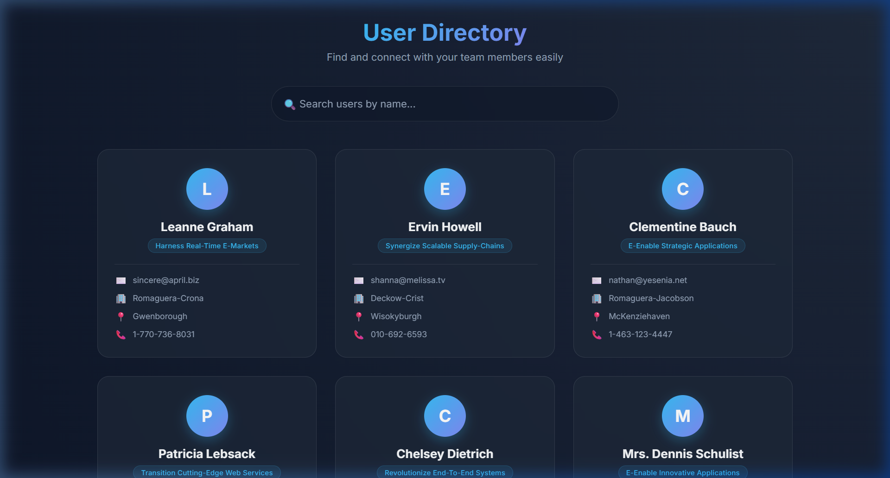
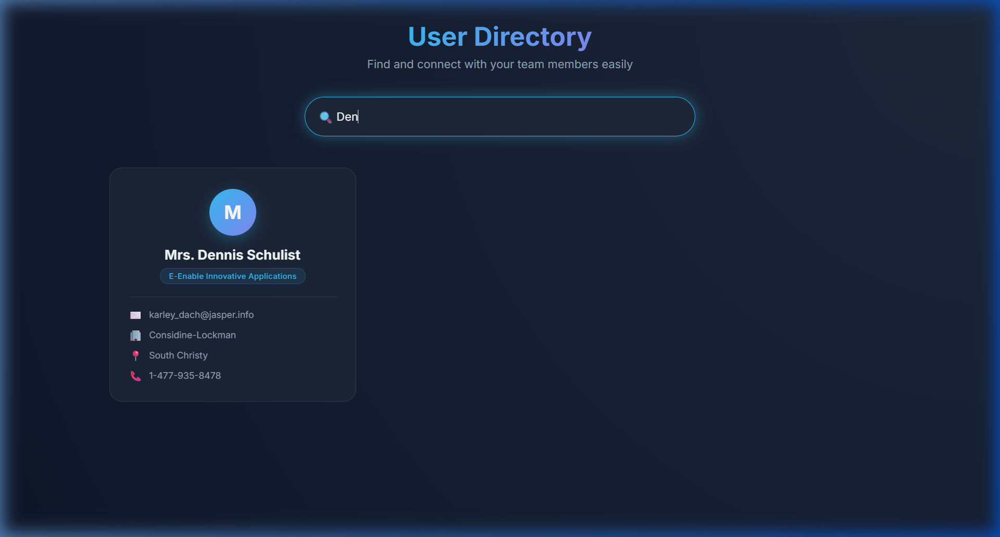
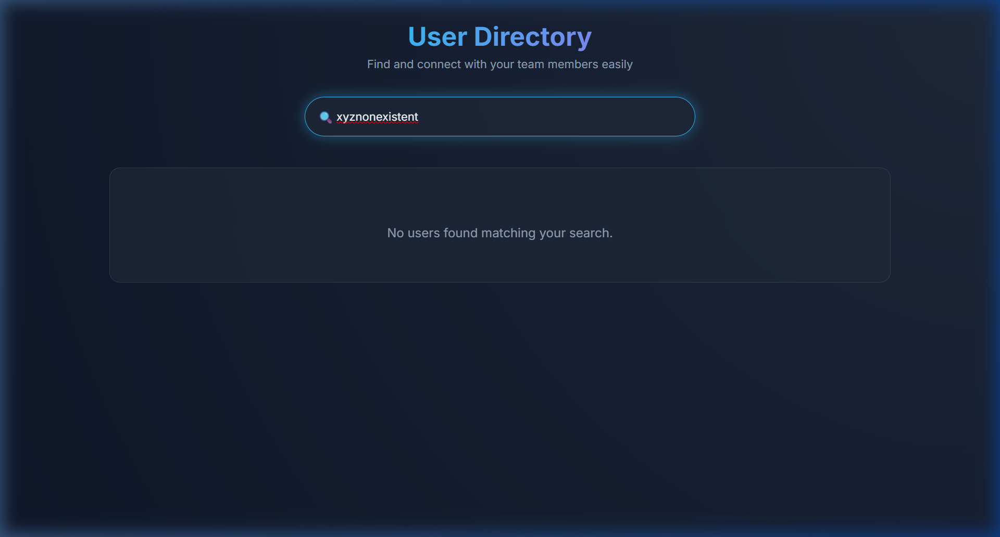

# 👥 User Directory

A sleek, modern React application that fetches and displays user profiles from an API. Built with a premium dark-mode glassmorphism UI, real-time search filtering, and responsive card-based layout.



---

## ✨ Features

- 🔍 **Real-time Search** — Instantly filter users by name as you type
- 📡 **API Integration** — Fetches user data from [JSONPlaceholder](https://jsonplaceholder.typicode.com/users)
- 🃏 **Rich User Cards** — Displays name, email, company, city, and phone
- ⏳ **Loading State** — Animated spinner while data is being fetched
- ⚠️ **Error Handling** — Graceful error display if the API call fails
- 📱 **Responsive Design** — Works seamlessly on desktop, tablet, and mobile
- 🎨 **Premium UI** — Dark mode with glassmorphism effects, gradient accents, and smooth animations

---

## 📸 Screenshots

### Main View
All users displayed in a responsive card grid with centered avatars and detailed info.


### Search Filtering
Real-time filtering — as you type in the search bar, cards update instantly.



### No Results State
Friendly messaging when no users match the current search query.



---

## 🛠️ Tech Stack

| Technology | Purpose |
|---|---|
| **React** | UI library for building component-based interfaces |
| **Vite** | Lightning-fast build tool and dev server |
| **Vanilla CSS** | Custom styling with CSS variables, glassmorphism, and animations |
| **Google Fonts (Inter)** | Modern, clean typography |
| **JSONPlaceholder API** | Free REST API providing mock user data |
| **JavaScript (ES6+)** | Application logic with async/await, array methods |

---

## 🏗️ Component Architecture

```
App
 ├── Header          → Gradient title and subtitle
 ├── SearchBar       → Controlled input for filtering users
 └── UserList        → Conditional rendering (loading / error / list)
       └── UserCard  → Individual user profile card
```

**Data flow:**
- `App` fetches users on mount using `useEffect` and stores them in state
- `SearchBar` updates the search term in `App` via a callback prop
- `App` filters users based on the search term and passes the result to `UserList`
- `UserList` maps through users and renders a `UserCard` for each

---

## 🚀 Getting Started

### Prerequisites

Make sure you have the following installed:
- [Node.js](https://nodejs.org/) (v18 or higher recommended)
- [npm](https://www.npmjs.com/) (comes with Node.js)

### Installation

1. **Clone the repository**

   ```bash
   git clone https://github.com/TejasSonawane02/user-directory.git
   cd user-directory
   ```

2. **Install dependencies**

   ```bash
   npm install
   ```

3. **Start the development server**

   ```bash
   npm run dev
   ```

4. **Open in browser**

   Navigate to `http://localhost:5173` in your browser.

### Build for Production

```bash
npm run build
```

The optimized output will be in the `dist/` folder.

---

## 📂 Project Structure

```
user-directory/
├── public/
├── src/
│   ├── components/
│   │   ├── Header.jsx        # App title and tagline
│   │   ├── SearchBar.jsx     # Search input with controlled state
│   │   ├── UserList.jsx      # List renderer with loading/error states
│   │   └── UserCard.jsx      # Individual user profile card
│   │
│   ├── App.jsx               # Main component (state, API fetch, filtering)
│   ├── App.css               # Complete application styling
│   └── main.jsx              # React DOM entry point
│
├── screenshots/              # App screenshots for README
├── .gitignore
├── index.html
├── package.json
├── vite.config.js
└── README.md
```

---

## 🌐 API Reference

This project uses the [JSONPlaceholder Users API](https://jsonplaceholder.typicode.com/users):

```
GET https://jsonplaceholder.typicode.com/users
```

Returns an array of 10 mock user objects with fields including:
- `name`, `email`, `phone`
- `company.name`, `company.bs`
- `address.city`

---

## 🎨 Design Highlights

- **Dark Mode** — Deep navy background with radial gradients
- **Glassmorphism** — Semi-transparent cards with backdrop blur
- **Gradient Accents** — Blue-to-purple gradient on avatars and header
- **Micro-animations** — Smooth hover lift effects on cards with accent glow
- **Role Badge** — Company tagline displayed as a stylish pill badge
- **Responsive Grid** — Auto-filling CSS Grid that adapts from 1 to 3 columns

---
